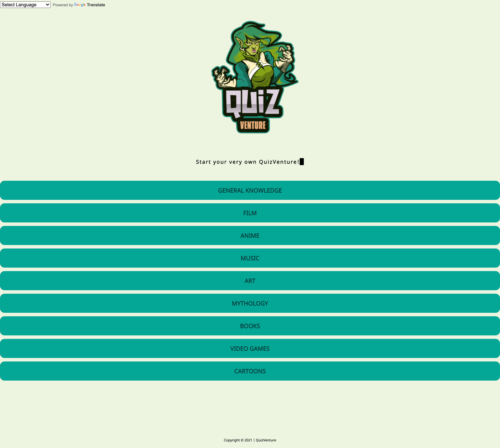
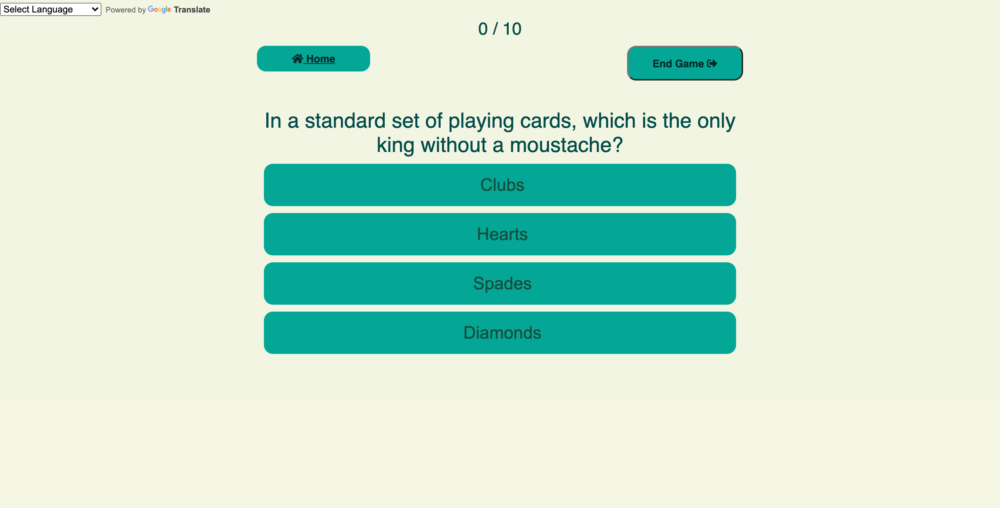
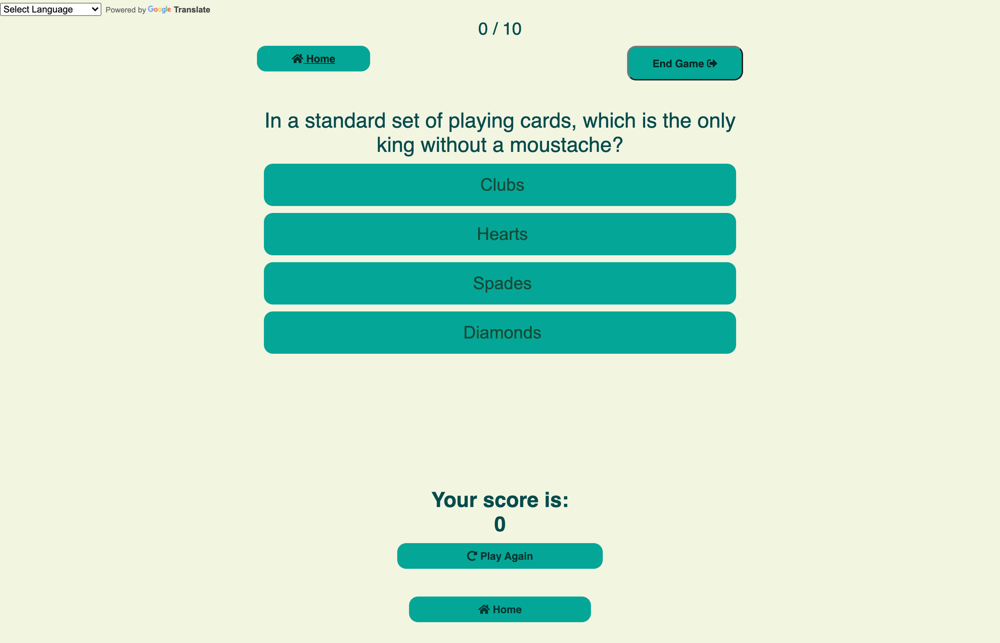
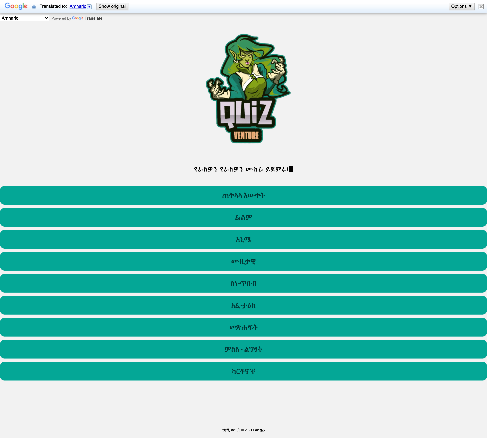

- [Deployed Github Page](#deployed-github-page)
  - [Contributors](#contributors)
  - [Formalities](#formalities)
  - [Project Overview](#project-overview)
      - [Jquery](#jquery)
      - [Skeleton](#skeleton)
- [What We Did](#what-we-did)
  - [Functionality](#functionality)
  - [Planning](#planning)
  - [Development](#development)
    - [Success](#success)
    - [Challenges](#challenges)
  - [Evaluation](#evaluation)
- [Future Development](#future-development)
  - [Style](#style)
  - [Features](#features)
- [Screenshots](#screenshots)

# Deployed Github Page 
[ Click here to view the deployed github page](https://jcazx.github.io/QuizVenture/)

## Contributors 
Aisha Yasin - [Github](https://github.com/aisha-ysn)

Feras Faid - [Github](https://github.com/Osir-is)

Jordelle Clarke Anderson - [Github](https://github.com/Jcazx)

## Formalities 
- Clone the Github project onto the local machine
- Navigate into the project
- Open the project in VSCode
- Open the `index.html` file in your default browser
```
git clone git@github.com:Jcazx/QuizVenture.git
code .
```
## Project Overview

## Description 
QuizVenture is a dynamic online web aplication that offers users the ability to take part in a choose your own adventure style quiz game. It allows user to spend their time online learning instead of being idle.

## User Story 
As a user i want to be able to take part in a trivia quiz of my choosing and i will be able to translate it into any language i need to.

```
GIVEN a QuizVenture homepage with options for each quiz 
WHEN i press on one of the options i am able to do the quiz that i have chosen 
THEN when i click to see my score it will show at the bottom of my screen and give me the option to play again or go to the home page 
WHEN i click on the google translate button it translates the entire website 
```
## Programmes Used 
### API's
#### [Google translate Api](https://cloud.google.com/translate)
We used the google translate api because of how smoothly the documentation made it to implement into our code
#### [Trivia Api](https://opentdb.com/api_config.php)
The trivia api that we used to create our questions allowed us to use a range of categories and choose the number of questions that we wished to use on our code. 
### Frameworks
#### [Jquery](https://jquery.com/)
#### [Skeleton](http://getskeleton.com) 
we chose to use the skeleton for our results page because of skeleton's focus on smaller projects as noted in their documentation. It was one of the frameworks that actually slotted pretyy well into our pre exisitng css that we had already started working on 
# What We Did
## Functionality 
We used multiple javascript pages for each different type of quiz  and used Apis to render the wuestions for the quiz and as well as using a translate Api to translate the content on the pages and we used local storage to allow for user inout and to allow them to store their name so that the site starts to feel aa little bit more personalised 
## Planning
Before we began touching any code we did a lot of talking and planning. We made flow charts, wire frames and a lot of deliberating on what would work the best. While planning did take some time the entire team feels tha planning things out benefited us in the long run when trying to create this project.
## Development 
The general development of the project was aided by our knowledge of how to structure quizes and then taking the time to collaborate and use  our different expertise.
### Success
The planning of the project was extremely successful and as a group we found it easy to work together with towards our end goal. Creating the readme, figuring how to spend our time and actually creating the code for our quiz's were all things that we did really easy 
### Challenges
We found some trouble with the actual APIS. our original plan was to create 3 personality type quiz's on 3 different topics and give the user a result based on their questions. However two of the Apis we attempted to use we ran into a lot of trouble with causing us to have to change our original plan.
## Evaluation
In hindsight we would definitely try out these API's a little bit more before we realised how much we needed to utilise it. We would also probably try to experiment with some apis that give us a wider breadth of content to use instead of using apis that provide us with more linear content 
# Future Development 
## Style 
In the future we would add more animations to the styles and possibly utilise some more complicated styles to make our website look slightly more professional. We woulkd also like to add more images within the project and if possible we would like to use our Apis to add more images that are interactive and have somethignntop don with the quuizes that the users are taking.
## Features
We would add an area where users can see the previous scores that they got on other trivia quiz's as well as a score board that ranks the users alongside their top scores so that people on the site can see how well they are doing in comparison to their peers. By utilising local storage we would be abel to give users the feeling of competing with their peers.
# Screenshots 




